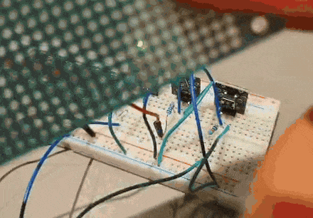

# Light-Reactive LED with Button Toggle

An Arduino project combining a photoresistor, a pushbutton, and a PWM LED
in one circuit. Built to practice using a sensor, an input, and an output
together instead of one concept at a time.

I prototyped in Wokwi first to get the wiring right, then moved to real hardware.

The button toggles the LED on and off. While the LED is on, its brightness
follows the ambient light level — cover the sensor and the LED brightens,
expose it to light and the LED dims.

## How it works

- `analogRead()` reads the photoresistor on pin A2.
- A pushbutton on pin 2 (internal pull-up, `INPUT_PULLUP`) toggles the LED state.
- While on, `map()` converts the sensor reading to a PWM value for `analogWrite()`.
- Button state and sensor values are printed to Serial for debugging.

## What actually happened building this

The button gave me the most trouble in Wokwi. The two switch contacts kept
bridging the same breadboard columns instead of separate ones, so the button
was permanently shorted. Took a few rounds against Wokwi's diagram to catch it.
Once I moved to real hardware, that part worked immediately.

The sensor had its own surprise: in my room the raw reading only moved between
about 0 and 16, not the theoretical 0–1023. Mapping that tiny range to full
brightness meant nothing visibly changed when I covered the sensor. Rescaling
`map()` to the real-world range fixed it immediately.

## Demo

Covering the photoresistor changes the LED brightness in real time.
The Pico visible on the breadboard is not part of this circuit.

## What I would improve

- Proper debounce instead of relying on the polling delay.
- Auto-calibrate the sensor min/max on startup instead of hardcoding a
  range measured in one room.
